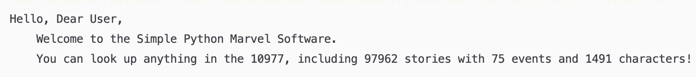

# Python-Marvel-Project
A project that uses the official marvel API. 

<h2>Stage One: Defining and Idealing</h2>
Since recently I read about an article talking about the marvel's official API and I thought that is interesting. I am expecting myself to build a software that allows users to look up any marvel-related info. Although I am not a marvel person at all, I would love to give this comic API a try. 

Any People who are interested in the large universe created by Marvel would be a potential user of this software. Some possible negative consequence is that this can be a story spoiler. 

This project is meant to be build mainly in Python 3 and the Marvel API; however, some other techniques and software may be needed during the production. 

Some potential difficulties could be the convinience of this software. I will add an User Interface(UI) in it, but whether it actually gives the users a good feel depends on its design and functionality.

The Project is expected to be build primarily by using PyCharm on a Mac, and git will be used as a version control tool. 

## Stage Two: Prototyping and Testing 
Originally it is designed as a command line application, which means that it is only executable in terminal or the command prompt. Users has to type in the command so that the software can respond to their requests. 

## Stage Three: Discussion
This software is small, and probably not many potential users are expected. Therefore, a user tests is not as necessary as other projects (Also due to its small range of users, it makes it harder to conduct a user research)

## Stage Four: Demo

## Stage Five: Reflection
The project is a project that allows user to see how many characters there are in the Marvel Universe. It was inspired by an article talking about the public API that Marvel officially offered on their website which contains all the heros and events exisiting in the current Marvel Universe. The purpose of this project is to allow Marvel Fans to browse the topic they like through the software, although I myself is not a Marvel fan at all. I have previous knowledge of Python that helps. In the project, the fetching of data from the official API works well, and I was able to get some of the results; however, I did not quite understand their document. Therefore, only part of the data can be shown by this software (not all of the data that I requested from the API was able to be shown by the API because I didn't understand the method to print them out). One of the learning outcome I expected to have is to understand more about how to use APIs, and I did not fully meet my expectations because I failed to print out some of the data. I need to improve on understanding other documentations next time. Stage 1 to 3 helps me in terms of defining how to use the API; however, as mentioned, it my personal reason of not understanding the documents that limited the potential of this software. Therefore, next time it would be a great mission for me to practice my documentation reading ability. 
